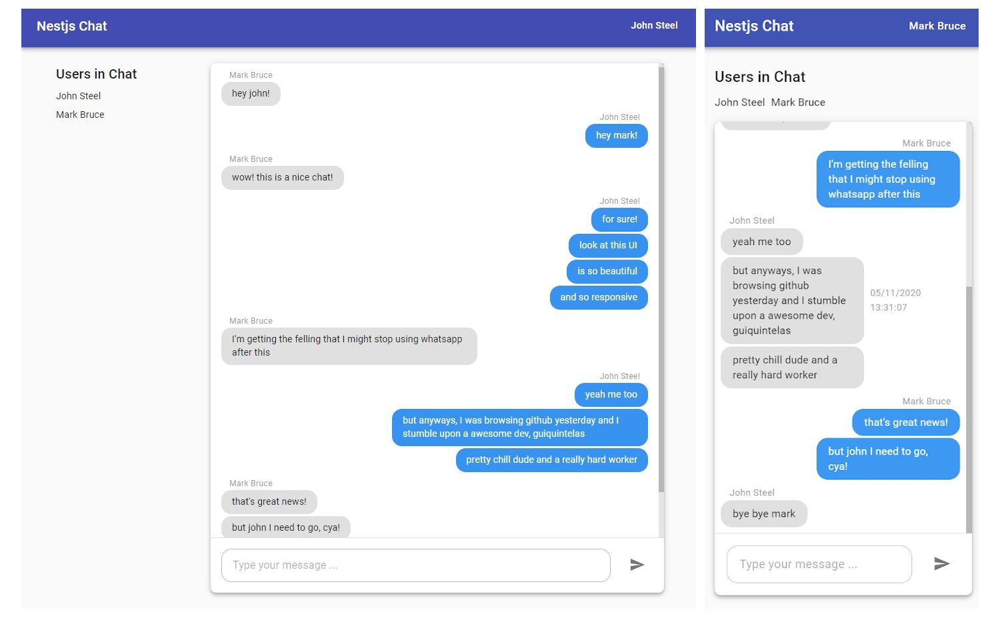

# NestJs Chat

A simple real time group chat interface developed using `React`, `Typescript`, `MaterialUI`, `ApolloClient` and `GraphQL Code Generator`!

This is the ``front-end`` for the [nestjs-chat-api](https://github.com/guiquintelas/nestjs-chat-api) repo



### Running
``` sh
# first we need to run the graphql api
# to enable GraphQL Code Generator
git clone https://github.com/guiquintelas/nestjs-chat-api.git
cd nestjs-chat-api
cp .env-example .env
docker-compose up -d
yarn && yarn start:dev

# and now, in a new terminal, we can run the front-end
cd ..
git clone https://github.com/guiquintelas/nestjs-chat-front.git
cd nestjs-chat-front
cp .env-example .env
yarn # install dependencies
yarn gen # generate typescript typing ans react hooks
yarn start
```


# ⚙️ Technologies
  - React
  - MaterialUI
  - Apollo Client
  - GraphQL Code Generator
  - Formik
  - Typescript

# 🚧 Roadmap
  - Features
    - Track online users (users listening for new messages)
    - Multiple group chats
    - Message Pagination
    - Virtual List
    - Refactor both repos to one monorepo
  - Technical Debt
    - Write tests
    - Handle api errors

